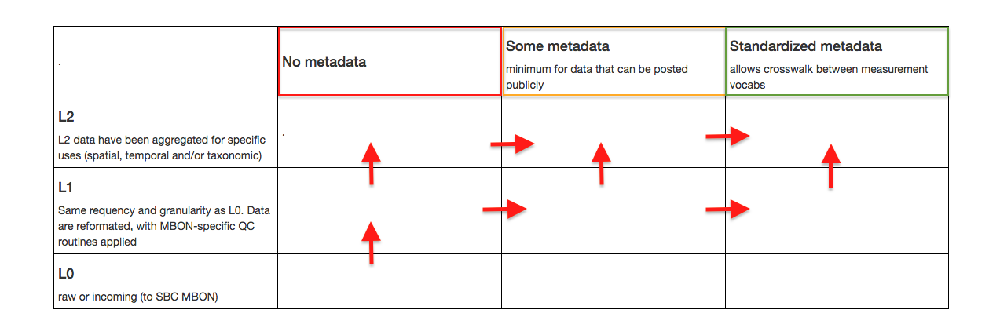

 

<!-- close this div below the point where you want these style rules to apply, eg, bottom of the page. -->
        <h1>Dataset Workflows</h1>
    <h2>Overview</h2>
    
For planning and tracking progress, SCB MBON's data workflows are arranged by stage. Our processing stages "Raw", "Cleaned" and "Standarized metadata", are based on the generic workflow created by the MBON data managers (MBON DMAC, 2016), and shown in color in Figure 1. These stages generally refer to the amount of formal metadata available, and the degree to which data and metadata have been prepared for inclusion in a pubic repository.  
        
Additionally, SCB MBON recognizes a series of processing levels to describe use in our research, and which are analagous to that used by NASA for satellite products: 
        <ul>
        <li>L0 (Level zero) data are considered 'raw' for SCB MBON purposes, although they may be considered 'final' by a contributing project. Some L0 data can be found in public repositories.</li>
        <li>L1 (Level one) data have the same frequency and granularity as L0. Data have been reformated for SCB MBON, with our specific quality control routines applied. Generally, reformatting and QC are performed by SCB MBON.</li>
        <li>L2 data have been aggregated for specific uses, also by SCB MBON. Aggregation may be spatial, temporal and/or taxonomic (e.g., combined taxa)</li>
        </ul>
        
        
    
The combinations of stage and level are best expresses as a matrix for two reasons. First, research data often have insufficient metadata (e.g., they are 'L0, some metadata'), and although these may be found in public repositories, considerable work is required to bring them to the quality level necessary for SCB MBON integration. Secondly, SCB MBON distinguished between incoming data (even if these are already in public repositories), and datasets that it produces (that may be derived from incoming). Hence,  every workflow is tracked through both stages and levels. Progression through levels and stages is typically diagonal, step-wise between boxes (individual stages) - either up, or to the right.   In the lower left area of the matrix, almost all processing tasks require ad hoc code, but code reuse is likely for tasks in the upper right.

         
    
Datasets ready for consumption or reuse are contributed to a public repository capable of handling revisioned updates and DOIs, and with an API so that time-series continuity is maintained, previous revisions are always availble, and data can be retrieved with code. Our goal is to create datasets which are general enough for a variety of purposes; we include code for generating certain formats if available.

<table class="figs">
    <tr> 
        <td> Figure 1. Generic MBON data processing workflow. Text describes creation of data that are "Standardized", indicated by the red arrow.  <em>From: MBON DMAC. 2016. Data management alignment, Workshop report</em></td>
        <td width="50%"></td>
    </tr>
    <tr>
        <td>Figure 2. Matrix of processing stages from Fig 1 (outlined in red, orange, green) against content levels (see Workflow template, below), with arrows indicating the general progression of data and metadata from "Raw" to "Standardized/aggregated".</td> 
        <td width="50%"></td>    
    </tr>
</table>
    
    

    <h2>Workflow Template</h2>
    <table class="workflow">
        <tr>
            <td width="25%">&nbsp;</td>
            <td width="25%" class="no_metadata"><h4>No formal metadata</h4>data are exchanged interally only and are likely to change</td>
            <td width="25%" class="some_metadata"><h4>Some formal metadata</h4>minimum for data that can be posted publicly</td>
            <td width="25%" class="std_metadata"><h4>Standardized, formal fmetadata</h4>allows crosswalk between measurement vocabularies</td>
        </tr>
        <tr>
            <td><h4>L2</h4>
                L2 data have been aggregated for specific uses (spatial, temporal and/or taxonomic)
            </td>
            <td> </td>
            <td></td>
            <td></td>
        </tr>
        <tr>
            <td><h4>L1</h4>Same frequency and granularity as L0. Data are reformated, with MBON-specific QC routines applied (usually by SCB MBON)</td>
            <td></td>
            <td> </td>
            <td><em>[ideal input]</em></td>
        </tr>
        <tr>
            <td><h4>L0</h4>raw or incoming (to SCB MBON)</td>
            <td></td>
            <td> </td>
            <td> </td>
        </tr>
    </table>

  
  <h2>Dataset-specific workflows</h2>
  
<h3 id="KFR">Kelp forest/Reef</h3>
<h4>Summary</h4>

Data from four ongoing time series projects (PISCO, SBC-LTER,
    CINP and SNI) examining kelp forest reef species with various collection methods and measures of abundance of were integrated from through 2015. As processing and provenance protocols develop, future dataset revisions will include additional pertinent metadata and code. We will create Standardized Metadata for abunance measurements when appropriate vocabularies are available.

<table class="workflow">
    <tr>
        <td width="25%">&nbsp;</td>
        <td width="25%" class="no_metadata"><h4>No formal metadata</h4>data are exchanged interally only and are likely to change</td>
        <td width="25%" class="some_metadata"><h4>Some formal metadata</h4>minimum for data that can be posted publicly</td>
        <td width="25%" class="std_metadata"><h4>Standardized, formal metadata</h4>allows crosswalk between measurement vocabularies </td>
    </tr>
    <!-- Row 1, Level 2 - aggregated data. -->
    <tr>
        <td><h4>L2</h4>
        L2 data have been aggregated for specific uses (spatial, temporal and/or taxonomic)
        </td>
        <!--  -->
        <!-- agg, 0 meta -->
        <td>
        <!-- <dl><dt>Files for proof-of-concept map application (Devin, Ben)</dt>
            <dd>fish_density_web.csv</dd>
            <dd>fish_diversity_web.csv</dd>
            <dd>kelp_biomass_web.csv</dd>
            <dd>mobile_invertebrates_web.csv</dd>
        </dl>-->
        </td>
        <!-- col 2 - agg, some meta -->
        <td>
        Done, three aggregated datasets produced. <a href="{{site.url}}/data/catalog/index.html#KFR">See catalog</a>
        </td>
        <!-- col 3 - agg, std meta -->
        <td></td>
    </tr>
    <!--
    Row 2, Level 1 - cleaned data. -->
    <tr>
        <td><h4>L1</h4>Same frequency and granularity as L0. Data are reformatted, with MBON-specific QC routines appied (usually by SCB MBON)</td>
        <!-- L1 cleaned, 0 meta -->
        <td>    
            <dl>
                <dt>Cleaned reef fish, inverts and algae</dt>
                <dd>intermediate csv used by SCB MBON</dd>
            </dl>
        </td>
        <!-- L1 cleaned, some meta -->
        <td>
                <dl>
                    <dt>Cleaned reef fish, inverts and algae</dt>
                    <dd>intermediate csv used by SCB MBON</dd>
                </dl>
        </td>
        <!-- L1 cleaned, std meta -->
        <td></td>
    </tr>
    <!-- 
    Row 3, Level 0 -->
    <tr>
        <td><h4>L0</h4>raw or incoming (to SCB MBON). 
           </td>
        <!-- L0 raw, 0 meta -->
        <td>CINP, SNI data, not publicly available.</td>
        <!-- L0, some meta -->
        <td>
            <dl>
                <dt>LTER data, in a public repository:</dt>
                <dd><a href="https://portal.lternet.edu/nis/mapbrowse?scope=knb-lter-sbc&identifier=15&revision=newest">knb-lter-sbc.15</a></dd>
                <dd><a href="https://portal.lternet.edu/nis/mapbrowse?scope=knb-lter-sbc&identifier=17&revision=newest">knb-lter-sbc.17</a></dd>
                <dd><a href="https://portal.lternet.edu/nis/mapbrowse?scope=knb-lter-sbc&identifier=19&revision=newest">knb-lter-sbc.19</a></dd>
                <dt>PISCO data, in a public repository:</dt>
                    <dd><a href="">id</a>, TBA, offsite</dd>
                    <dd><a href="">id</a>, TBA, offsite</dd>
            </dl>
        </td>
        <!-- L0, std meta -->
        <td></td>
    </tr>
</table>

<h3 id="ASL">SCB MBON Species List</h3>
<h4>Summary</h4>

SCB MBON collects a list of taxa with levels (as appropriate) for all taxa encountered to date in any data we have used in research. Final dataset includes local (SCB MBON) IDs for reference, and authoritative codes from appropriate registries (e.g., FishBase, ITIS).

<table class="workflow">
    <tr>
        <td width="25%">&nbsp;</td>
        <td width="25%" class="no_metadata"><h4>No formal metadata</h4>data are exchanged interally only and are likely to change</td>
        <td width="25%" class="some_metadata"><h4>Some formal metadata</h4>minimum for data that can be posted publicly</td>
        <td width="25%" class="std_metadata"><h4>Standardized, formal metadata</h4>allows crosswalk between measurement vocabularies </td>
    </tr>
    <!-- Row 1, Level 2 - aggregated data. -->
    <tr>
        <td><h4>L2</h4>
        L2 data have been aggregated for specific uses (spatial, temporal and/or taxonomic)
        </td>
        <!--  -->
        <!-- agg, 0 meta -->
        <td>        &nbsp;        </td>
        <!-- col 2 - agg, some meta -->
        <td>
        Done, one datasets listing all taxa in all data products. <a href="{{site.url}}/data/catalog/index.html#ASL">See catalog</a>
        </td>
        <!-- col 3 - agg, std meta -->
        <td></td>
    </tr>
    <!--
    Row 2, Level 1 - cleaned data. -->
    <tr>
        <td><h4>L1</h4>Same frequency and granularity as L0. Data are reformatted, with MBON-specific QC routines appied (usually by SCB MBON)</td>
        <!-- L1 cleaned, 0 meta -->
        <td>    
            &nbsp;
        </td>
        <!-- L1 cleaned, some meta -->
        <td>
                <dl>
                    <dt>Cleaned reef fish, inverts and algae</dt>
                    <dd>intermediate csv used by SCB MBON</dd>
                </dl>
        </td>
        <!-- L1 cleaned, std meta -->
        <td></td>
    </tr>
    <!-- 
    Row 3, Level 0 -->
    <tr>
        <td><h4>L0</h4>raw or incoming (to SCB MBON). 
           </td>
        <!-- L0 raw, 0 meta -->
        <td>CINP, SNI data, not publicly available.</td>
        <!-- L0, some meta -->
        <td>
            <dl>
                <dt>LTER data, in a public repository:</dt>
                <dd><a href="https://portal.lternet.edu/nis/mapbrowse?scope=knb-lter-sbc&identifier=15&revision=newest">knb-lter-sbc.15</a></dd>
                <dd><a href="https://portal.lternet.edu/nis/mapbrowse?scope=knb-lter-sbc&identifier=17&revision=newest">knb-lter-sbc.17</a></dd>
                <dd><a href="https://portal.lternet.edu/nis/mapbrowse?scope=knb-lter-sbc&identifier=19&revision=newest">knb-lter-sbc.19</a></dd>
                <dt>PISCO data, Repository access TBD</dt>
                    <dd>ID-1</dd>
                    <dd>ID-2</dd>
            </dl>
        </td>
        <!-- L0, std meta -->
        <td></td>
    </tr>
</table>

<h2>References</h2>

MBON DMAC. 2016. Report:  Data management alignment, 2016 June 7-9, Santa Barbara CA. https://workspace.ioos.us/files/1912269/MBON_DM_workshop_2016_final_full.pdf

    
