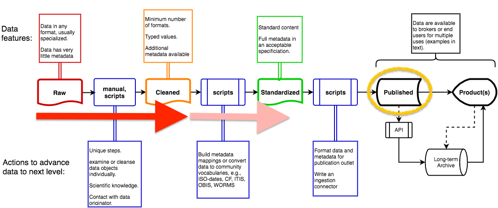

    
    <!-- close this div below the point where you want these style rules to apply, eg, bottom of the page. -->

         <h1>SCB MBON Data Management Overview</h1>

 <h2>Processing Pipeline</h2>

For planning and tracking progress, SCB MBON's data workflows are arranged by stage. Processing stages, "Raw", "Cleaned" and "Standarized metadata", are based on the generic workflow created by the MBON data managers (MBON DMAC, 2016), and shown on the left in Figure 1. These stages generally refer to the amount of formal metadata available, and the degree to which data and metadata have been prepared for inclusion in a pubic repository. SCB MBON data are currently published as "Cleaned". For some tables and their attributes, metadata will advance to "Standardized" after a) our table attributes have been mapped to appropriate external dictionaries (e.g., Darwin Core), and b) the EML specification handles semantic information. These conditions are both expected to be met during 2017 (e.g., the release of EML 2.2).

 

<strong>Figure 1. Generic MBON data processing workflow. SCB MBON currently are "Cleaned" with "Standardized" expected for some tables/attributes by the end of 2017 (red arrows).  The repository is indicated by gold oval. From: MBON DMAC. 2016. Data management alignment, Workshop report.</strong>
    

 <h2>Repositories Submissions</h2>

SCB MBON contributes all cleaned (curated) datasets to a public repository which supports DOIs, metadata and data immutability, and dataset versioning. We reduce redundant contributions by using federated systems that link multiple repositories a priori. The repository of the Environmental Data Initiative (EDI, <a href="https://environmentaldatainitiative.org">https://environmentaldatainitiative.org</a>) is a member node of the DataONE federation (<a href="https://dataone.org">https://dataone.org</a>), and so contributing there ensures that SCB MBON data can be found alongside data from other DataONE member nodes (with all available through a single API). NODC (NCEI division) is already a DataONE member node and AOOS and GCOOS are developing member node capabililty. Further, DataONE already supports Darwin Core, and is exploring indexing by GBIF, two features that will facilitate data flow to OBIS. 

SCB MBON maintains a catalog of its datasets in public repositories: <a href="../catalog/">SCB MBON Data catalog</a>.

     <h2>Dataset Packaging </h2>
    
SCB MBON datasets are classified according to their metadata needs (A, B or C). Because the EDI repository and DataONE support versioning, metadata and data can be enhanced in future revisions. 
      

<dl>
    

    <dt>A. Full metadata:</dt>
    <dd> Two types of datasets receive full (entity-level) metadata per the practices of LTER Network and EDI.
            
         <ol type="a">
             <li>Data collected <em>de novo</em> by the project. Data are owned by SCB MBON, and SCB MBON controls all metadata. 
               <dl>
                    <dt>examples</dt> 
                    <dd>abundance generated by Bisque imagery analysis 
                        environmental DNA</dd>
                </dl>
            </li>
            <li>Curated or reformatted external data. These are datasets for which SCB MBON is acting as a "broker". Many aspects of metadata are determined by the contributor: Data ownership, intellectual rights (although we encourage adoption of SCB MBON practices for ownership and licensing), collection methods, and processing code (where appropriate). If data were obtained from a repository or web service, SCB MBON includes that link as is possible, e.g. as data source under methods or provenance. 
                <dl>
                    <dt>examples</dt> 
                    <dd>CalCOFI Fish Larvae abundance 
                    Gray Whale Counts</dd>
                </dl>
            </li>
        </ol>
    </dd>

    <dt>B. Full metadata plus provenance:</dt> 
    <dd> Data products that result from integration of other datasets. These may be biodiversity indices or other integrations, e.g., combined abundances from several surveys. These products receive the highest level of metadata content,  full metadata (per LTER practices), plus provenance information (e.g., data sources, processing parameters and software) to ensure results are easy to interpret and trustworthy. Provenance via annotation is planned to use DataONE annotations (as these systems mature); currently provenance is included as text metadata under "Methods". 
        <dl>
        <dt>examples</dt> 
        <dd>Biodiversity indices 
        Integrated kelp forest fish and benthic cover</dd>
        </dl>
    </dd>

<dt>C. Cited exogenous data:</dt> 
    <dd>Source data that are already publicly available, and curated and managed by a non-SCB MBON group will be cited and linked in our catalog. If necessary, SCB MBON will create citation-level metadata to external resources, i.e., metadata adequate to produce a data citation that is analogous to a paper citation and consistent with ESIP guidelines. These include original creator, title, date, publisher, system and ID. A URL will be included if no persistent ID is available. 
        <dl>
        <dt>examples</dt> 
            <dd>Dataset of Giant Kelp biomass, produced by the Santa Barbara Coastal Long Term Ecological Research (LTER) project</dd>
        </dl>
    </dd>

</dl>

<h2>External Resources and References</h2>

<dl>
    <dt>EML Project</dt> 
        <dd> <a href="https://knb.ecoinformatics.org/#external//emlparser/docs/index.html" target="_blank">https://knb.ecoinformatics.org/#external//emlparser/docs/index.html</a> </dd>
        <dd><a href="https://github.com/NCEAS/eml" target="_blank">https://github.com/NCEAS/eml</a></dd>
    <dt>ESIP - Interagency Data Stewardship/Citations/provider_guidelines<dt>
        <dd><a href= "https://wiki.esipfed.org/index.php/Interagency_Data_Stewardship/Citations/provider_guidelines" target="_blank">https://wiki.esipfed.org/index.php/Interagency_Data_Stewardship/Citations/provider_guidelines</a></dd>
    <dt>MBON DMAC. 2016. Data management alignment, Workshop report</dt>
        <dd><a href="https://workspace.ioos.us/group/230656/project/1804166/folder/1818398/products" target="_blank">https://workspace.ioos.us/group/230656/project/1804166/folder/1818398/products></a></dd>

    
